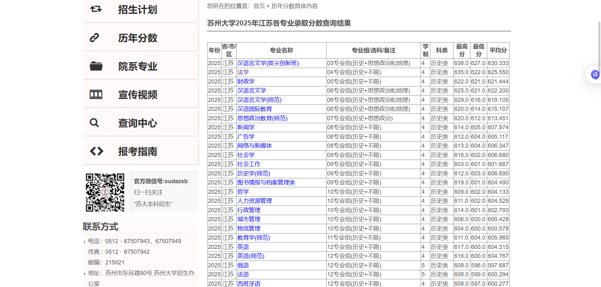
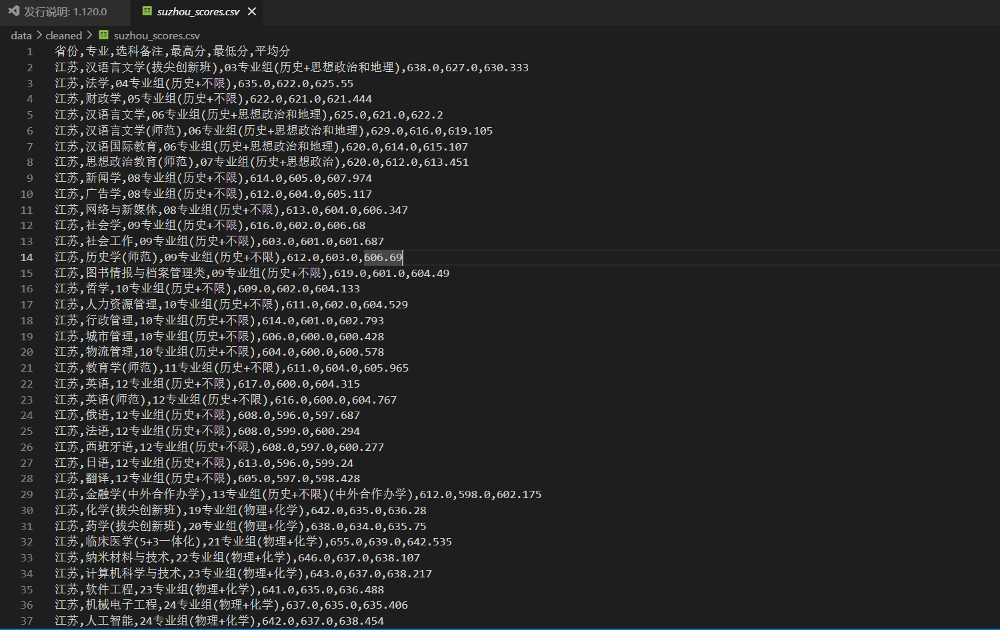

# gaokao-spider

高校录取分数线采集系统 —— 自动爬取各高校本科招生网公布的录取分数数据，支持 HTML 表格、Excel 附件、PDF 附件等多种数据源解析。

---

## 功能特性

- **多校适配**：基于插件化架构，每所学校独立爬虫模块，灵活适配不同官网结构
- **多格式解析**：支持 HTML 表格直接解析、Excel 下载解析、PDF 下载解析
- **数据标准化**：自动清洗表头、统一省份与科类命名、输出统一 CSV 格式
- **反爬策略**：内置 User-Agent 轮换、请求间隔、重试机制
- **双输出模式**：支持 CSV 文件输出和 MySQL 数据库存储
- **日志追踪**：完整的运行日志，方便调试与问题定位

---

## 项目架构

```
gaokao-spider/
├── main.py                      # 入口程序
├── config.py                    # 全局配置（学校URL、选择器、输出字段等）
├── requirements.txt             # 依赖列表
│
├── spiders/                     # 爬虫模块
│   ├── base_spider.py           # 爬虫基类（通用流程）
│   ├── suzhou_university.py     # 苏州大学爬虫
│   ├── ocean_university.py      # 中国海洋大学爬虫
│   ├── nanjing_normal_university.py  # 南京师范大学爬虫
│   └── __init__.py              # 爬虫注册表
│
├── parsers/                     # 解析器模块
│   ├── html_parser.py           # HTML 表格解析
│   ├── excel_parser.py          # Excel 文件解析
│   └── pdf_parser.py            # PDF 文件解析
│
├── storage/                     # 存储模块
│   ├── csv_writer.py            # CSV 输出
│   ├── mysql_writer.py          # MySQL 输出
│   └── schema.sql               # 数据库建表语句
│
├── utils/                       # 工具模块
│   ├── request_utils.py         # 网络请求（重试、UA轮换）
│   ├── file_downloader.py       # 附件下载
│   ├── text_cleaner.py          # 数据清洗与标准化
│   └── logger.py                # 日志工具
│
└── data/                        # 数据目录（.gitignore 排除）
    ├── raw/                     # 原始下载文件
    ├── cleaned/                 # 清洗后数据
    └── logs/                    # 运行日志
```

---

## 快速开始

### 1. 安装依赖

```bash
pip install -r requirements.txt
```

### 2. 运行爬虫

```bash
# 爬取苏州大学
python main.py --school suzhou

# 爬取中国海洋大学
python main.py --school ocean

# 爬取南京师范大学
python main.py --school nanjing_normal

# 爬取所有学校
python main.py --school all

# 同时输出 CSV 和 MySQL
python main.py --school suzhou --output both
```

### 3. 查看结果

爬取结果默认保存在 `data/cleaned/{school_key}_scores.csv`。

---

## 苏州大学示例

### 目标页面

苏州大学本科招生网的录取分数查询页直接展示数据表格，爬虫通过 `score_entry_url` 访问目标页面，使用 CSS 选择器 `#ctl00_ContentPlaceHolder1_GridView1` 定位表格并解析。

> **截图占位**：请将苏州大学录取分数查询页面截图放入 `docs/images/suzhou_page.png`，然后取消下方注释：
> ```markdown
> 
> ```

### 配置示例

```python
"suzhou": {
    "name": "苏州大学",
    "home_url": "https://zsb.suda.edu.cn/",
    "score_entry_url": "https://zsb.suda.edu.cn/search.aspx?text=...",
    "article_list_selector": "#ctl00_ContentPlaceHolder1_GridView1 a",
    "article_title_keywords": ["省/市/区", "专业名称", "专业组/选科/备注", "最高分", "最低分", "平均分"],
    "table_selector": "#ctl00_ContentPlaceHolder1_GridView1",
}
```

### 爬取结果样例

```csv
省份,专业,选科备注,最高分,最低分,平均分
江苏,汉语言文学(拔尖创新班),03专业组(历史+思想政治和地理),638.0,627.0,630.333
江苏,法学,04专业组(历史+不限),635.0,622.0,625.55
江苏,临床医学(5+3一体化),21专业组(物理+化学),655.0,639.0,642.535
江苏,计算机科学与技术,23专业组(物理+化学),643.0,637.0,638.217
江苏,人工智能,24专业组(物理+化学),642.0,637.0,638.454
```

> **截图占位**：请将 suzhou_scores.csv 文件内容截图放入 `docs/images/suzhou_csv.png`，然后取消下方注释：
> ```markdown
> 
> ```

苏州大学本次爬取共采集 **125 条** 专业录取记录，覆盖历史类、物理类、体育类、音乐类、美术类等多个科类批次。

---

## 扩展新学校

新增一所学校的标准流程：

1. **在 `config.py` 的 `SCHOOL_CONFIGS` 中添加配置**：
   - `name`: 学校名称
   - `score_entry_url`: 录取分数栏目入口 URL
   - `table_selector`: 数据表格 CSS 选择器（可选）
   - `article_title_keywords`: 文章标题关键词（用于列表页筛选）

2. **在 `spiders/` 下创建新爬虫类**（继承 `BaseSpider`）：
   - 若学校结构为「直接展示表格」（如苏州大学），重写 `discover_score_pages()` 返回目标 URL
   - 若学校结构为「文章列表 → 详情页」（如中国海洋大学），使用基类默认实现或微调选择器
   - 若页面结构特殊，重写 `parse_page()` 自定义解析逻辑

3. **在 `spiders/__init__.py` 中注册爬虫**：
   ```python
   from spiders.new_university import NewUniversitySpider
   SPIDER_REGISTRY["new_school"] = NewUniversitySpider
   ```

4. **运行测试**：
   ```bash
   python main.py --school new_school
   ```

---

## 配置说明

### 输出字段

当前输出字段在 `config.py` 的 `OUTPUT_COLUMNS` 中定义：

| 字段英文名 | 中文含义 | 说明 |
|-----------|---------|------|
| `province` | 省份 | 考生所在省份 |
| `major_name` | 专业 | 录取专业名称 |
| `major_group` | 选科备注 | 专业组及选科要求 |
| `max_score` | 最高分 | 该专业录取最高分 |
| `min_score` | 最低分 | 该专业录取最低分 |
| `avg_score` | 平均分 | 该专业录取平均分 |

如需完整字段（年份、学校、批次、位次、来源URL等），可切换为注释中的完整版 `OUTPUT_COLUMNS`。

### 请求配置

```python
REQUEST_CONFIG = {
    "timeout": 30,           # 请求超时（秒）
    "max_retries": 3,        # 最大重试次数
    "retry_delay": 2,        # 重试间隔（秒）
    "request_interval": 1.5, # 每次请求间隔（秒），遵守爬取礼仪
}
```

### MySQL 配置

如需存入数据库，在 `config.py` 的 `MYSQL_CONFIG` 中填写连接信息，并使用 `--output mysql` 或 `--output both` 运行。

---

## 支持的数据源类型

| 类型 | 说明 | 处理方式 |
|------|------|---------|
| HTML 表格 | 页面直接展示 `<table>` 标签 | `pandas.read_html` + CSS 选择器 |
| Excel 附件 | `.xls` / `.xlsx` 下载链接 | 自动下载 + `openpyxl`/`xlrd` 解析 |
| PDF 附件 | `.pdf` 下载链接 | 自动下载 + `pdfplumber` 解析 |
| 纯文本 PDF | 无表格结构的 PDF | 提取文本并输出警告（需手动处理） |

---

## 注意事项

1. **robots.txt**：请遵守目标网站的 robots.txt 规则，合理设置请求间隔，避免对高校招生网造成压力。
2. **页面结构变化**：高校官网改版频繁，CSS 选择器可能失效，需定期维护。
3. **反爬机制**：部分学校有 WAF 或 IP 限流，如遇 403/429 错误，可适当增大 `request_interval` 或接入代理池。
4. **动态渲染**：当前基于 `requests` 静态请求，若目标网站使用 Vue/React 等前端框架渲染数据，需接入 Playwright/Selenium。

---

## 技术栈

- Python 3.11+
- requests / urllib3 — 网络请求
- BeautifulSoup4 / lxml — HTML 解析
- pandas — 表格数据处理
- pdfplumber — PDF 解析
- openpyxl — Excel 解析
- PyMySQL — MySQL 存储

---

## License

MIT
